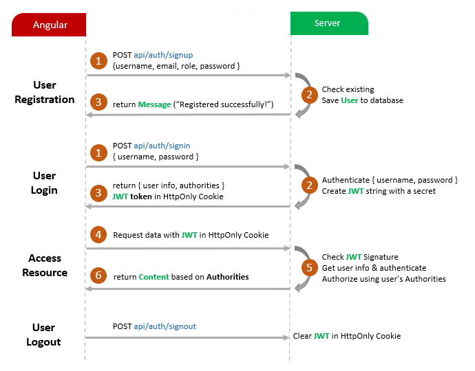
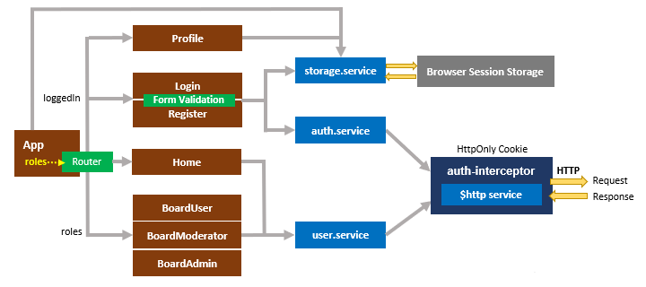

# AUTHOPHER - CLIENT 

 Angular 15 JWT Authentication & Authorization 
 
 It needs this backend app : 
 
  - authopher-server 
## Flow for User Registration and User Login
For JWT – Token based Authentication with Rest API, we will call 3 endpoints:
- POST `api/auth/signup` for User Registration
- POST `api/auth/signin` for User Login
- POST `api/auth/signout` for User Logout

You can take a look at following flow to have an overview of Requests and Responses that Angular 15 JWT Authentication & Authorization Client will make or receive.

## Angular JWT App Diagram with Router and HttpInterceptor

 